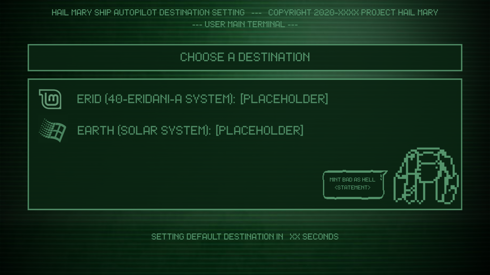
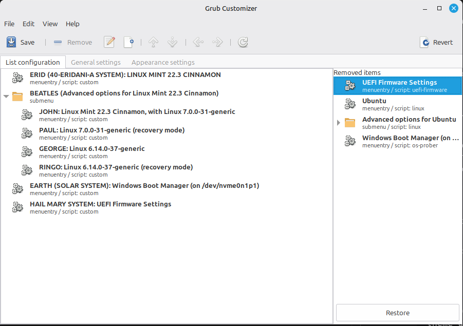
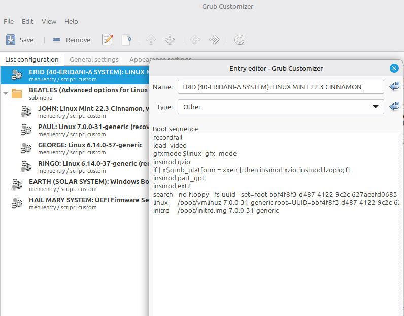

# Project Hail Mary GRUB theme

> [!IMPORTANT]  
> I took an existing GRUB theme and only changed a few things like images and messages. Installation details and the original design can be found at [this repository](https://github.com/shvchk/fallout-grub-theme).

Supported languages are: Chinese (simplified), Chinese (traditional), English, French, German, Hungarian, Italian, Korean, Latvian, Norwegian, Polish, Portuguese, Russian, Rusyn, Spanish, Turkish, Ukrainian



> [!NOTE]  
> This is just a rough example of how it would look like.

---

## Installation/Updates

> [!WARNING]  
> For this custom theme I have used the software [Grub Customizer](https://forums.linuxmint.com/viewtopic.php?t=208452) to make a custom name for each option. This software may not be available for all users.

### Secure way

- Download install script:

    ```sh
    wget -P /tmp https://raw.githubusercontent.com/As4ncab/phm-theme-grub/refs/heads/main/install.sh
    ```

- Review it at `/tmp/install.sh`

- Run it:

    ```sh
    bash /tmp/install.sh
    ```

### Easier, less secure way

Just download and run install script:

  ```sh
  wget -O - https://raw.githubusercontent.com/As4ncab/phm-theme-grub/refs/heads/main/install.sh| bash
  ```

> [!TIP]  
> If your computer can't find the path to a file, you can find the link manually instead from Github.

You can use `--lang` option to select language and disable interactive language selection, e.g.:

```sh
bash /tmp/install.sh --lang German
```

or

```sh
wget -O- https://raw.githubusercontent.com/As4ncab/phm-theme-grub/refs/heads/main/install.sh | bash -s -- --lang Korean
```

Full list of languages see in `INSTALLER_LANGS` variable in [install.sh](install.sh)

## Custom Settings

For this part we will need to install Grub Customizer. Once installed, you can open the app to find the list of the current operative systems found by GRUB.



There you can either select an O.S. to rename it, or edit it. Just type in your custom name in the "Name" placeholder as shown bellow:



> [!CAUTION]  
> If you choose the "Edit" option, remember to be careful when if you want to change the boot sequence.

Once you are done with the customization, hit the "Save" button and then "File > Install to MBR...".

Now your GRUB should be set!
